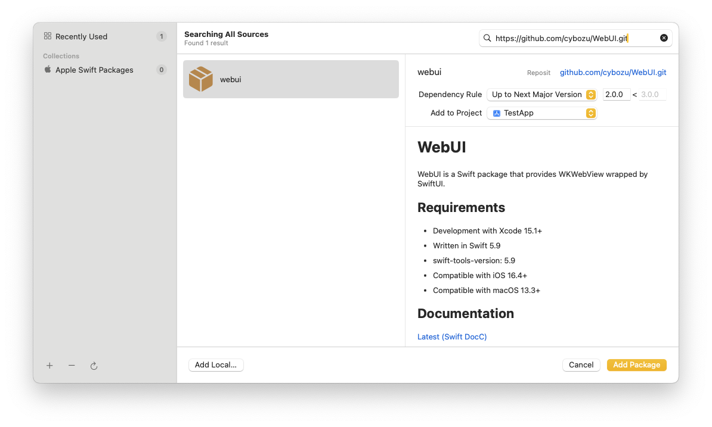
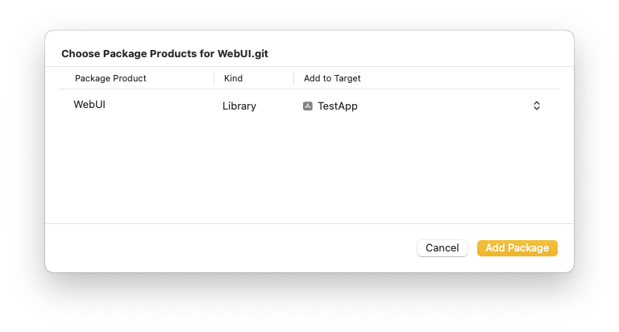

# WebUI

WebUI is a Swift package that provides WKWebView wrapped by SwiftUI.

[](https://github.com/cybozu/WebUI/issues)
[](https://github.com/cybozu/WebUI/network/members)
[](https://github.com/cybozu/WebUI/stargazers)
[](https://github.com/cybozu/WebUI/)
[]()
[](https://github.com/cybozu/WebUI/)

## Requirements

- Development with Xcode 15.4+
- Written in Swift 5.9
- Compatible with iOS 16.4+
- Compatible with macOS 13.3+

## Documentation

[Latest (Swift-DocC)](https://cybozu.github.io/WebUI/documentation/webui/)

## Privacy Manifest

This library does not collect or track user information, so it does not include a PrivacyInfo.xcprivacy file.

## Installation

WebUI is available through [Swift Package Manager](https://github.com/apple/swift-package-manager/).

**Xcode**

1. File > Add Package Dependencies…
2. Search `https://github.com/cybozu/WebUI.git`.  
   
3. Add package and link `WebUI` to your application target.  
   

**CLI**

1. Create `Package.swift` that describes dependencies.

   ```swift
   // swift-tools-version: 5.9
   import PackageDescription

   let package = Package(
       name: "SomeProduct",
       products: [
           .library(name: "SomeProduct", targets: ["SomeProduct"])
       ],
       dependencies: [
           .package(url: "https://github.com/cybozu/WebUI.git", exact: "2.0.0")
       ],
       targets: [
           .target(
               name: "SomeProduct",
               dependencies: [
                   .product(name: "WebUI", package: "WebUI")
               ]
           )
       ]
   )
   ```

2. Run the following command in Terminal.
   ```sh
   $ swift package resolve
   ```

## Usage

```swift
struct ContentView: View {
    var body: some View {
        WebViewReader { proxy in
            WebView()
                .onAppear {
                    proxy.load(request: URLRequest(url: URL(string: "https://www.example.com")!))
                }
        }
        .padding()
    }
}
```

## Demo

This repository includes demonstration app for iOS & macOS.

Open [Examples/Examples.xcodeproj](/Examples/Examples.xcodeproj) and Run it.
